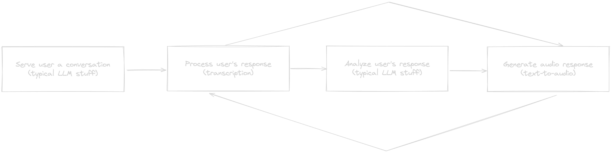
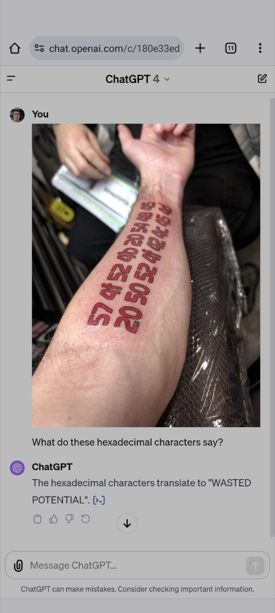

# Conversation Partners

#### Building conversation-compatible AI partners

---

## <!-- paginate: true -->

# Who are we?

Birmingham AI

- Big group (loads of backgrounds)
- Smaller group (engineer types)
- My name's Rob, I'm a senior engineer @ [Hasura](https://hasura.io/)

---


---

> humans are the hardest, if only i could get by speaking to computers all day <sigh>

\- A Tired Engineer

---

# But, why?

Make being dumb cheap.

---

# Okay, not being dumb...make **learning** cheap

- Shorter feedback loops
- Quicker, more targeted interventions
- Specific and authentic feedback

---

# Potential implementations

- Languages
- Patient histories for new medical professionals
- Plumbers diagnosing laypeople's descriptions of their problems
- Therapists learning how to ask questions to convince patients to open up...

---


---

# Architecture

Why does it matter?

---

# Architecture

- Scalability
- Maintainability
- Flexibility

---

# Architecture

An endpoint for every purpose:

```ts
app.use("/", generateConversation);
app.use("/", respondToUser);
app.use("/", analyzeUserResponse);
app.use("/", convertTextToAudio);
app.use("/", convertAudioToText);
```

---

# Architecture

Tomorrow, we want to add new functionality? Easy.

```ts
app.use("/", generateConversation);
app.use("/", respondToUser);
app.use("/", analyzeUserResponse);
app.use("/", convertTextToAudio);
app.use("/", convertAudioToText);
// New capability
app.use("/", talkNerdyToMe);
```

---

# What does this allow us to do?



---

# Principles

- [Clean Architecture](https://blog.cleancoder.com/uncle-bob/2012/08/13/the-clean-architecture.html) layers
- SRP throughout the `/core` lib of the application
- Exposed functionality using our `/server` as the gateway
- Each can me modified, maintained, and swapped out independently without breaking each other

---

# Architecture

```bash
├── core
│   ├── config
│   │   └── openAi.ts
│   ├── conversation
│   │   ├── analyzeResponse.ts
│   │   ├── generateConversation.ts
│   │   ├── index.ts
│   │   ├── respondToUser.ts
│   └── speech
│       ├── audioToText.ts
│       ├── index.ts
│       └── textToAudio.ts
├── index.ts
└── server
    ├── app.ts
    └── routes
        ├── analyzeConversation.ts
        ├── convertAudioToText.ts
        ├── convertTextToAudio.ts
        ├── generateConversation.ts
        ├── healthcheck.ts
        └── respondToUser.ts
```

---

# Implementation

Our API exposes this route (interface) 👇

```ts
export default router.get(
  "/analyzeUserResponse",
  async (req: Request, res: Response) => {
    //   Inputs from the request
    const dialogue = req.body.dialogue;

    console.log(`🏫 Got a request to analyze a user's response`);

    //   We'll validate them first
    if (!dialogue) {
      res.json({ error: "You must include the dialogue you wish to analyze" });
    }

    // New conversation
    const response = await analyzeResponse(dialogue);

    console.log(`✅ Analyzed user's response`);

    return res.json({ analysis: response });
  },
);
```

---

# Implementation

Which calls the following logic (use case) using the `QuestionObject` type:

```ts
type QuestionObject = {
  questionInTargetLanguage: string;
  questionInEnglish: string;
  summary: string;
  userResponse: string;
  analysis: string;
};
```

```ts
export async function analyzeResponse(dialogue: QuestionObject) {
  try {
    const response = await openai.chat.completions.create({
      model: "gpt-4-turbo-preview",
      messages: [
        {
          role: "system",
          content: `You are a language teaching expert who focuses on conversation-based learning and is conversing with me. In our most recent dialogue,
          you said, "${dialogue.questionInTargetLanguage}" and I responded with, "${dialogue.userResponse}. Analyze my response and provide me with either
          a passing or failing grade for how I responded. If my response is failing, respond with how I can improve.`,
        },
      ],
    });
    return response.choices[0].message.content;
  } catch (err) {
    console.error(err);
  }
}
```

---

# Benefits of this approach

- Independence between layers
- Confidence in changes
- Dependency inversion
- Parallel development without clashes

---

# But I want to learn about APIs!

---

# Deep Dive on OpenAI's APIs

- We all know about the `chat` API
- But there are others:
  - `audio/transcription`
  - `audio/speech`
  - `vision`

---

# Use of these APIs

Regardless of which we use, they're all doing the same thing under the hood »

<!-- TODO: Add image -->

---

# Which is...

More or less [RAG](https://blogs.nvidia.com/blog/what-is-retrieval-augmented-generation/) 🤷‍♂️

---

# How well do these work?

---



---

# How well do these work?

Let's find out! Demo time 🎉

---

# Competition 👀

We've [an issue](https://github.com/Birmingham-AI/conversation-partner/issues/1) on this repo with a $50 gift card to
GPBC bounty 🍻

---

# We need YOU!


